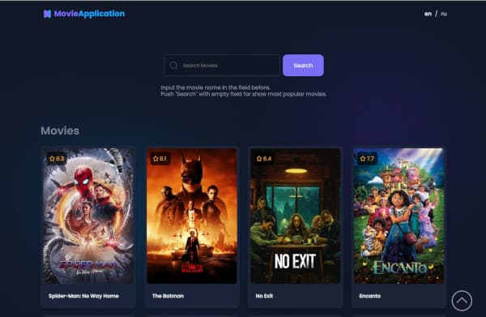
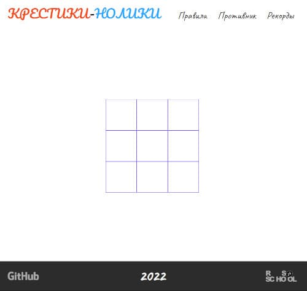

# Alexey Gorbenko's Curriculum Vitae

## Table of contents

  - [Personal information](#personal-information)
  - [Contact information](#contact-information)
  - [About](#about)
  - [Skills](#skills)
  - [Code example](#code-example)
  - [Projects](#projects)
  - [Education](#education)
  - [Foreign languages](#foreign-languages)

## Personal information


_Name:_ **Alexey**.

_Surname:_ **Gorbenko**.

_Date of birth:_ 23<sup>rd</sup> of March, 1981.

## Contact information

_Location:_ **Rostov-on-Don, Russian Federation**.

_E-mail:_ [a.v.gor@mail.ru](mailto:a.v.gor@mail.ru).

_Telegram:_ [@alexey_gorbenko](https://t.me/alexey_gorbenko).

_Discord (rs-school):_ [alexey-gorbenko (@a-v-gor)](https://discordapp.com/users/873419814985674802/).

***

## About

My goal is to become a good front-end developer. I have everything for this: mathematical thinking, perseverance, ability to learn and IT-background. For about ten years I work in IT and I like it. I see my professional growth in programming.

***

## Skills

- Programming languages and technologies:
  - JavaScript;
  - HTML5;
  - CSS3;
  - GIT (Bash).
- CMS (Content Management systems):
  - Wordpress;
  - Joomla;
  - Drupal.
- Developer Tools:
  - Visual Studio Code;
  - Figma;
  - Adobe Photoshop;
  - Adobe Illustrator;
  - GIMP;
  - Inkscape.

***

## Code example

> The goal is to implement a difference function, which subtracts one list from another and returns the result.

```js
function arrayDiff(a, b) {
  return a.filter((item) => !b.includes(item));
}
```

***

## Projects

### Photographer's portfolio.

> Project from Stage 0 Rolling Scopes School. The tasks are:
> - make fixed layout;
> - make adaptive layout (for width from 1440+ px to 320 px) with burger menu,
> - add interactive changing images in section "Portfolio", add translate on two languages and functionality for changing themes (light and dark) using JavaScript.
> - add videoplayer using JavaScript.

[](https://rolling-scopes-school.github.io/a-v-gor-JSFEPRESCHOOL/portfolio/)

[Link on page.](https://rolling-scopes-school.github.io/a-v-gor-JSFEPRESCHOOL/portfolio/)

### Movie App.

> Project from Stage 0 Rolling Scopes School. The task is to make application, which show information (get with using API) about movies, which user search.

[](https://rolling-scopes-school.github.io/a-v-gor-JSFEPRESCHOOL/movie-app/)

[Link on application.](https://rolling-scopes-school.github.io/a-v-gor-JSFEPRESCHOOL/movie-app/)

### Tic Tac Toe.

> Project from Stage 0 Rolling Scopes School. The task is to make Tic-Tac-Toe game for two players with information about winners of last ten games. I added game against computer.

[](https://rolling-scopes-school.github.io/a-v-gor-JSFEPRESCHOOL/tic-tac-toe/)

[Link on application.](https://rolling-scopes-school.github.io/a-v-gor-JSFEPRESCHOOL/tic-tac-toe/)

***

## Education

2022 - now - **Front-end (JS) developer (Stage 1)**.

_The Rolling Scopes School._

2021 - 2022 - **Front-end (JS) developer (Stage 0)**.

_The Rolling Scopes School._

2017 - 2020 - **Software technician**.

_Rostov-on-Don College of Radio Electronics, Information and Industrial Technologies._

2019 - **Software engineer (retraining courses)**.

_Krasnodar Multidisciplinary Institute of Continuing Education._

***

## Foreign languages
English - A2.

***
[To top](#alexey-gorbenkos-curriculum-vitae)